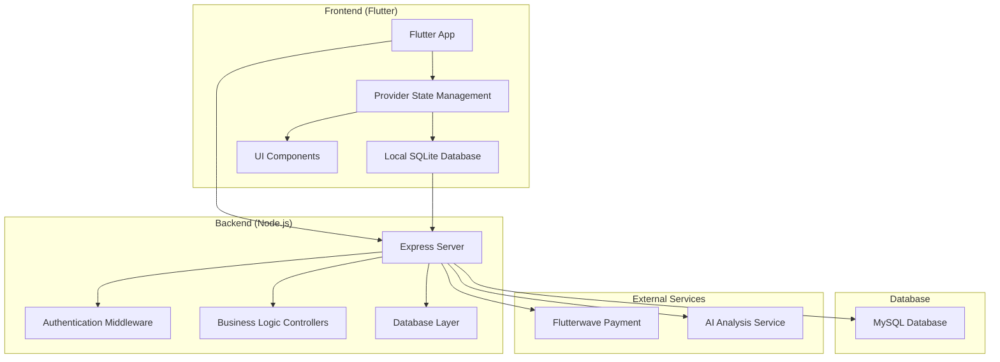
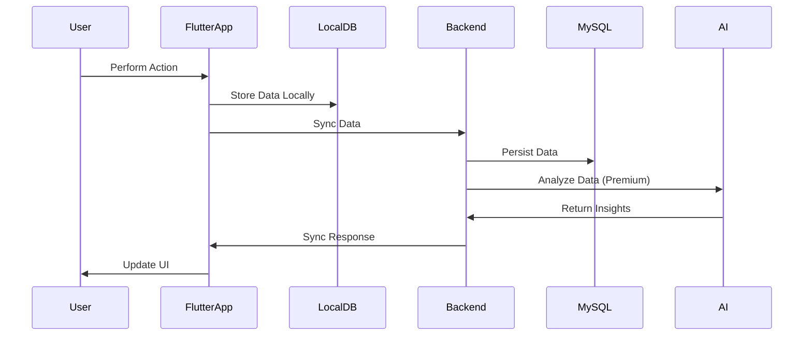
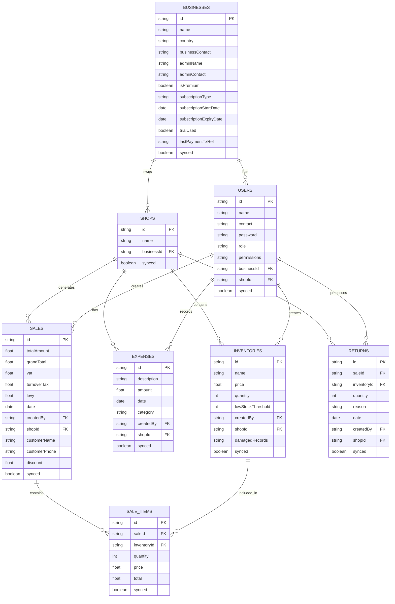

# Kantemba Finances

A comprehensive business finance management application designed for small to medium enterprises. Kantemba Finances provides complete financial tracking, inventory management, sales monitoring, and advanced reporting capabilities with AI-powered insights.


## 📋 Table of Contents

- [Overview](#overview)
- [Features](#features)
- [Architecture](#architecture)
- [Technology Stack](#technology-stack)
- [Installation & Setup](#installation--setup)
- [Usage Guide](#usage-guide)
- [API Documentation](#api-documentation)
- [Database Schema](#database-schema)
- [Deployment](#deployment)
- [Contributing](#contributing)
- [License](#license)

## 🎯 Overview

Kantemba Finances is a full-stack business management solution that helps businesses track their finances, manage inventory, monitor sales, and generate comprehensive reports. The application supports both single-shop and multi-shop operations with role-based access control.

### Key Capabilities

- **Financial Management**: Track expenses, sales, and revenue
- **Inventory Control**: Manage stock levels and track damaged goods
- **Multi-Shop Support**: Manage multiple business locations
- **Advanced Reporting**: Generate balance sheets, profit/loss statements, and cash flow reports
- **AI-Powered Insights**: Get intelligent financial analysis and recommendations
- **Employee Management**: Role-based access control for team members
- **Cloud Sync**: Automatic data synchronization across devices
- **Tax Compliance**: Built-in tax calculation and reporting

## ✨ Features

### Core Features

#### 📊 Financial Management
- **Sales Tracking**: Record and manage sales transactions
- **Expense Management**: Categorize and track business expenses
- **Returns Processing**: Handle customer returns and refunds
- **Tax Calculations**: Automatic VAT, turnover tax, and levy calculations
- **Discount Management**: Apply and track customer discounts

#### 📦 Inventory Management
- **Stock Tracking**: Monitor inventory levels in real-time
- **Low Stock Alerts**: Automatic notifications for low stock items
- **Damaged Goods Tracking**: Record and manage damaged inventory
- **Price Management**: Set and update product pricing
- **Stock Valuation**: Calculate total inventory value

#### 🏪 Multi-Shop Operations
- **Shop Management**: Create and manage multiple locations
- **Centralized Control**: Manage all shops from a single dashboard
- **Location-Specific Reports**: Generate reports for individual shops
- **Cross-Shop Analytics**: Compare performance across locations

#### 👥 Employee Management
- **Role-Based Access**: Define permissions for different user roles
- **User Management**: Add, edit, and manage employee accounts
- **Activity Tracking**: Monitor user activities and performance
- **Permission Control**: Granular access control for different features

#### 📈 Advanced Reporting
- **Balance Sheet**: Comprehensive asset and liability reporting
- **Profit & Loss**: Detailed income and expense analysis
- **Cash Flow**: Track cash inflows and outflows
- **Tax Summary**: Tax compliance and reporting
- **Financial Snapshot**: Quick overview of business health

#### 🤖 AI-Powered Analytics
- **Trend Analysis**: Identify financial trends and patterns
- **Predictive Insights**: Forecast future financial performance
- **Smart Recommendations**: AI-driven business recommendations
- **Automated Analysis**: Intelligent report analysis

### Premium Features

- **Unlimited Employees**: No restrictions on team size
- **Multi-Shop Management**: Manage unlimited shop locations
- **Advanced AI Analysis**: Enhanced AI-powered financial insights
- **Cloud Storage**: Secure cloud backup and synchronization
- **Priority Support**: Dedicated customer support
- **Custom Reports**: Build custom financial reports

## 🏗️ Architecture

### System Architecture



### Data Flow



### Database Schema



## 🛠️ Technology Stack

### Frontend
- **Framework**: Flutter 3.7.2+
- **State Management**: Provider 6.1.5
- **Local Database**: SQLite (sqflite 2.3.0)
- **HTTP Client**: http 1.4.0
- **UI Components**: Material Design
- **Platform Support**: Android, iOS, Web, Windows, macOS, Linux

### Backend
- **Runtime**: Node.js with Bun
- **Framework**: Express.js 5.1.0
- **Database**: MySQL with Sequelize ORM
- **Authentication**: JWT (jsonwebtoken 9.0.2)
- **Password Hashing**: bcryptjs 3.0.2
- **CORS**: cors 2.8.5

### External Services
- **Payment Processing**: Flutterwave Standard
- **File Operations**: File picker, CSV export
- **Connectivity**: Connectivity Plus
- **Notifications**: Flutter Local Notifications
- **URL Handling**: URL Launcher

## 📦 Installation & Setup

### Prerequisites

- Flutter SDK 3.7.2 or higher
- Node.js 18+ or Bun
- MySQL 8.0+
- Git

### Frontend Setup

1. **Clone the repository**
   ```bash
   git clone https://github.com/your-username/kantemba_finances.git
   cd kantemba_finances
   ```

2. **Install Flutter dependencies**
   ```bash
   flutter pub get
   ```

3. **Configure environment variables**
   Create a `.env` file in the root directory:
   ```env
   API_BASE_URL=http://localhost:4000/api
   FLUTTERWAVE_PUBLIC_KEY=your_flutterwave_public_key
   ```

4. **Run the application**
   ```bash
   flutter run
   ```

### Backend Setup

1. **Navigate to backend directory**
   ```bash
   cd backend
   ```

2. **Install dependencies**
   ```bash
   bun install
   # or with npm
   npm install
   ```

3. **Configure environment variables**
   Create a `.env` file in the backend directory:
   ```env
   PORT=4000
   DB_HOST=localhost
   DB_USER=your_db_user
   DB_PASSWORD=your_db_password
   DB_NAME=kantemba_finances
   JWT_SECRET=your_jwt_secret_key
   FLUTTERWAVE_SECRET_KEY=your_flutterwave_secret_key
   ```

4. **Set up database**
   ```sql
   CREATE DATABASE kantemba_finances;
   ```

5. **Run the server**
   ```bash
   bun run dev
   # or with npm
   npm run dev
   ```

### Database Migration

The application uses Sequelize for database management. Tables are created automatically when the application starts.

## 📖 Usage Guide

### Getting Started

1. **Launch the application**
   - The app will show a splash screen during initialization
   - Choose between "Sign up business" or "Log in"

2. **Business Registration**
   - Fill in business details (name, country, contact information)
   - Create admin account with secure password
   - Choose subscription plan (Free or Premium)

3. **Initial Setup**
   - Add your first shop location
   - Set up initial inventory items
   - Configure tax settings

### Core Workflows

#### Sales Management
1. Navigate to Sales screen
2. Tap "New Sale" button
3. Select items from inventory
4. Enter customer details (optional)
5. Apply discounts if needed
6. Complete transaction

#### Inventory Management
1. Go to Inventory screen
2. Add new items with name, price, and quantity
3. Set low stock thresholds
4. Monitor stock levels
5. Update quantities as needed

#### Expense Tracking
1. Access Expenses screen
2. Record new expenses with description and amount
3. Categorize expenses for better reporting
4. Track expense trends over time

#### Financial Reporting
1. Navigate to Reports screen
2. Choose report type (Balance Sheet, P&L, Cash Flow, etc.)
3. Select date range
4. Generate and export reports

### User Roles & Permissions

#### Admin
- Full access to all features
- User management
- Business settings
- Premium features

#### Manager
- Shop management
- Sales and inventory access
- Employee supervision
- Basic reporting

#### Employee
- Limited access based on permissions
- Sales recording
- Inventory viewing
- Basic operations

## 🔌 API Documentation

### Authentication

All API endpoints require authentication via JWT token in the Authorization header:
```
Authorization: Bearer <jwt_token>
```

### Core Endpoints

#### Business Management
```
POST /api/business/register
POST /api/business/login
GET /api/business/profile
PUT /api/business/update
POST /api/business/upgrade
```

#### User Management
```
POST /api/users/register
POST /api/users/login
GET /api/users
PUT /api/users/:id
DELETE /api/users/:id
```

#### Shop Management
```
POST /api/shops
GET /api/shops
PUT /api/shops/:id
DELETE /api/shops/:id
```

#### Inventory Management
```
POST /api/inventory
GET /api/inventory
PUT /api/inventory/:id
DELETE /api/inventory/:id
```

#### Sales Management
```
POST /api/sales
GET /api/sales
PUT /api/sales/:id
DELETE /api/sales/:id
```

#### Expense Management
```
POST /api/expenses
GET /api/expenses
PUT /api/expenses/:id
DELETE /api/expenses/:id
```

#### Returns Management
```
POST /api/returns
GET /api/returns
PUT /api/returns/:id
DELETE /api/returns/:id
```

#### AI Analysis
```
POST /api/ai/analyze
```

#### Data Synchronization
```
POST /api/sync/batch
GET /api/sync/status
```

### Response Format

All API responses follow this format:
```json
{
  "success": true,
  "data": {},
  "message": "Operation successful"
}
```

Error responses:
```json
{
  "success": false,
  "error": "Error message",
  "code": "ERROR_CODE"
}
```

## 🗄️ Database Schema

### Core Tables

#### businesses
Stores business information and subscription details.

#### users
Manages user accounts with role-based permissions.

#### shops
Represents business locations for multi-shop operations.

#### inventories
Tracks product inventory with pricing and stock levels.

#### expenses
Records business expenses with categorization.

#### sales
Stores sales transactions with tax calculations.

#### sale_items
Links sales to specific inventory items.

#### returns
Tracks customer returns and refunds.

## 🚀 Deployment

### Frontend Deployment

#### Android
```bash
flutter build apk --release
```

#### iOS
```bash
flutter build ios --release
```

#### Web
```bash
flutter build web --release
```

### Backend Deployment

#### Using Docker
```dockerfile
FROM oven/bun:latest
WORKDIR /app
COPY package.json .
COPY bun.lock .
RUN bun install
COPY . .
EXPOSE 4000
CMD ["bun", "run", "src/server.ts"]
```

#### Environment Variables
Ensure all required environment variables are set in production:
- Database credentials
- JWT secret
- Payment gateway keys
- API endpoints

### Production Considerations

1. **Database**: Use production-grade MySQL instance
2. **SSL**: Enable HTTPS for all communications
3. **Backup**: Implement regular database backups
4. **Monitoring**: Set up application monitoring
5. **Scaling**: Consider load balancing for high traffic

## 🤝 Contributing

We welcome contributions! Please follow these steps:

1. Fork the repository
2. Create a feature branch (`git checkout -b feature/amazing-feature`)
3. Commit your changes (`git commit -m 'Add amazing feature'`)
4. Push to the branch (`git push origin feature/amazing-feature`)
5. Open a Pull Request

### Development Guidelines

- Follow Flutter coding standards
- Write comprehensive tests
- Update documentation for new features
- Ensure backward compatibility
- Test on multiple platforms

### Code Style

- Use meaningful variable and function names
- Add comments for complex logic
- Follow the existing code structure
- Maintain consistent formatting

## 📄 License

This project is licensed under the MIT License - see the [LICENSE](LICENSE) file for details.

## 📞 Support

For support and questions:

- **Email**: support@kantemba.com
- **Documentation**: [docs.kantemba.com](https://docs.kantemba.com)
- **Issues**: [GitHub Issues](https://github.com/your-username/kantemba_finances/issues)

## 🔄 Version History

- **v1.0.0** - Initial release with core features
- **v1.1.0** - Added AI-powered analytics
- **v1.2.0** - Multi-shop management
- **v1.3.0** - Advanced reporting features

---

**Kantemba Finances** - Empowering businesses with intelligent financial management.

*Built with ❤️ using Flutter and Node.js*
