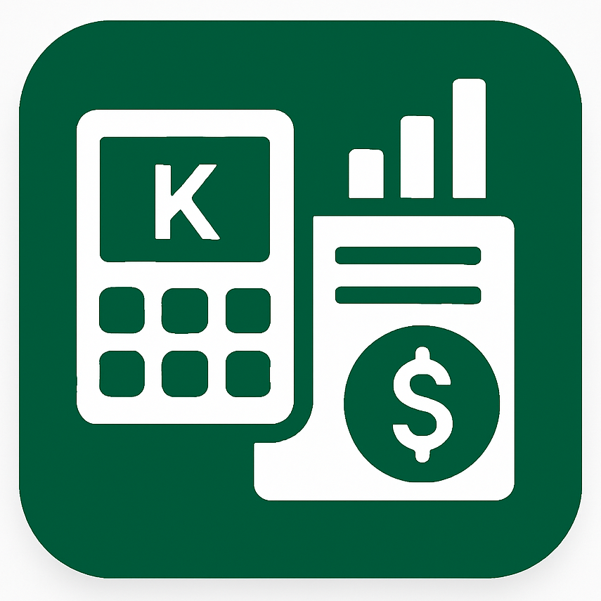

# Kantemba Finances - User Guide for Zambian Businesses

*Your Complete Guide to Financial Management in Zambia*



## 📋 Table of Contents

- [Welcome to Kantemba Finances](#welcome-to-kantemba-finances)
- [Getting Started](#getting-started)
- [Core Features](#core-features)
- [Zambian Tax Compliance](#zambian-tax-compliance)
- [Business Management](#business-management)
- [Sales & Inventory](#sales--inventory)
- [Financial Reporting](#financial-reporting)
- [Employee Management](#employee-management)
- [Settings & Configuration](#settings--configuration)
- [Troubleshooting](#troubleshooting)
- [Support & Contact](#support--contact)

## 🎯 Welcome to Kantemba Finances

**Kantemba Finances** is your complete business management solution designed specifically for Zambian businesses. Whether you run a small shop in Lusaka, a restaurant in Kitwe, or a multi-location business across Zambia, our app helps you manage your finances, track inventory, and stay compliant with ZRA regulations.

### Why Choose Kantemba Finances?

✅ **Zambian Tax Compliant** - Built-in VAT, Turnover Tax, and Levy calculations  
✅ **Local Currency Support** - Kwacha (K) with proper formatting  
✅ **ZRA Integration** - Tax reporting and compliance features  
✅ **Multi-Location Support** - Manage multiple shops across Zambia  
✅ **Offline Capability** - Works without internet connection  
✅ **Mobile Money Integration** - Flutterwave payment processing  
✅ **Local Support** - Zambian customer service team  

### Who Can Use Kantemba Finances?

- **Small Business Owners** - Track daily sales and expenses
- **Shop Managers** - Manage inventory and staff
- **Restaurant Owners** - Handle food costs and sales
- **Market Traders** - Track daily transactions
- **Multi-Shop Businesses** - Centralized management
- **Tax Consultants** - Generate ZRA-compliant reports

## 🚀 Getting Started

### Step 1: Download and Install

1. **Download the App**
   - Available on Google Play Store and Apple App Store
   - Search for "Kantemba Finances"
   - Click "Install" or "Get"

2. **First Launch**
   - Open the app
   - You'll see the welcome screen with our green calculator logo
   - Tap "Get Started"

### Step 2: Create Your Business Account

1. **Choose Account Type**
   - Tap "Sign up business" for new businesses
   - Tap "Log in" if you already have an account

2. **Business Registration**
   ```
   Business Name: [Your Business Name]
   Business Contact: [Phone/Email]
   Country: Zambia (pre-filled)
   Admin Name: [Your Name]
   Admin Contact: [Your Phone/Email]
   ```

3. **Create Password**
   - Choose a strong password (minimum 6 characters)
   - Include numbers and letters for security

### Step 3: Initial Setup

1. **Add Your First Shop**
   - Enter shop name (e.g., "Main Branch", "Lusaka Shop")
   - This will be your primary location

2. **Configure Tax Settings**
   - VAT Rate: 16% (Zambian standard)
   - Turnover Tax: 4% (for businesses below VAT threshold)
   - Levy: 1.5% (as applicable)

3. **Add Initial Inventory**
   - Start with your most important items
   - Set prices in Kwacha (K)
   - Set stock quantities

## 💼 Core Features

### 📊 Dashboard Overview

Your home screen shows key business metrics:

- **Today's Sales**: K amount sold today
- **Total Sales**: K amount for selected period
- **Total Expenses**: K amount spent
- **Profit**: K net profit (Sales - Expenses)
- **Stock Value**: K value of current inventory
- **Low Stock Alerts**: Items needing restocking

### 🛒 Sales Management

#### Recording a Sale

1. **Navigate to Sales**
   - Tap the "Sales" tab in bottom navigation
   - Tap the "+" button to add new sale

2. **Select Items**
   - Search or browse your inventory
   - Tap items to add to sale
   - Adjust quantities as needed

3. **Customer Information** (Optional)
   - Customer Name: For customer tracking
   - Customer Phone: For follow-up

4. **Apply Discounts** (If Applicable)
   - Enter discount amount in Kwacha
   - Or percentage discount

5. **Review Tax Calculation**
   - VAT: Automatically calculated at 16%
   - Turnover Tax: Applied if applicable
   - Levy: Applied if applicable
   - Total: Final amount including taxes

6. **Complete Sale**
   - Tap "Complete Sale"
   - Receipt will be generated
   - Inventory automatically updated

#### Sale Receipt Example
```
KANTEMBA FINANCES
Lusaka Shop
Date: 15/12/2024

Items:
- Rice (2kg) x K25.00 = K50.00
- Cooking Oil (1L) x K35.00 = K35.00
- Tomatoes (1kg) x K15.00 = K15.00

Subtotal: K100.00
VAT (16%): K16.00
Turnover Tax (4%): K4.00
Levy (1.5%): K1.50

Total: K121.50
```

### 📦 Inventory Management

#### Adding New Items

1. **Navigate to Inventory**
   - Tap "Inventory" in bottom navigation
   - Tap "+" to add new item

2. **Item Details**
   ```
   Item Name: [Product Name]
   Price: K[Amount]
   Quantity: [Number in stock]
   Low Stock Alert: [Minimum quantity]
   ```

3. **Save Item**
   - Tap "Save" to add to inventory
   - Item appears in your stock list

#### Managing Stock Levels

- **View Stock**: See all items with current quantities
- **Update Quantities**: Tap item to edit stock levels
- **Low Stock Alerts**: Red indicators for items below threshold
- **Damaged Goods**: Record damaged items separately

#### Stock Tracking Features

- **Real-time Updates**: Stock levels update with each sale
- **Stock Value**: Total value of current inventory
- **Stock History**: Track stock changes over time
- **Stock Reports**: Generate inventory reports

### 💰 Expense Tracking

#### Recording Expenses

1. **Navigate to Expenses**
   - Tap "Expenses" in bottom navigation
   - Tap "+" to add new expense

2. **Expense Details**
   ```
   Description: [What the expense is for]
   Amount: K[Amount spent]
   Category: [Select category]
   Date: [Date of expense]
   ```

3. **Expense Categories**
   - **Rent**: Shop/business premises
   - **Utilities**: Electricity, water, internet
   - **Stock**: Purchasing inventory
   - **Transport**: Fuel, vehicle maintenance
   - **Marketing**: Advertising, promotions
   - **Staff**: Salaries, training
   - **Other**: Miscellaneous expenses

4. **Save Expense**
   - Tap "Save" to record expense
   - Expense appears in your expense list

#### Expense Management Features

- **Categorized Tracking**: Organize expenses by type
- **Monthly Reports**: See spending patterns
- **Expense Trends**: Track spending over time
- **Budget Tracking**: Compare actual vs planned expenses

### 🔄 Returns & Refunds

#### Processing Returns

1. **Navigate to Returns**
   - Tap "Returns" in bottom navigation
   - Tap "+" to process new return

2. **Select Original Sale**
   - Search for the original sale
   - Tap to select sale for return

3. **Select Items to Return**
   - Choose items being returned
   - Adjust quantities as needed
   - Enter return reason

4. **Return Reasons**
   - **Damaged**: Item damaged during transport
   - **Defective**: Item not working properly
   - **Wrong Item**: Customer received wrong product
   - **Customer Request**: Customer changed mind
   - **Quality Issue**: Item doesn't meet standards

5. **Process Return**
   - Tax calculations automatically adjusted
   - Inventory updated accordingly
   - Return receipt generated

## 🇿🇲 Zambian Tax Compliance

### Understanding Zambian Taxes

#### VAT (Value Added Tax)
- **Rate**: 16%
- **Applies to**: Most goods and services
- **Threshold**: Businesses with turnover above K800,000 annually
- **Registration**: Required with ZRA for VAT-registered businesses

#### Turnover Tax
- **Rate**: 4%
- **Applies to**: Businesses below VAT threshold
- **Threshold**: Turnover below K800,000 annually
- **Simplified**: Single tax instead of VAT

#### Levy
- **Rate**: 1.5%
- **Applies to**: Specific goods and services
- **Examples**: Some agricultural products, certain services

### Tax Configuration

#### Setting Up Tax Rates

1. **Navigate to Settings**
   - Tap "Settings" in bottom navigation
   - Tap "Tax Compliance Settings"

2. **Configure Tax Authority**
   - Select "ZRA (Zambia)" from dropdown
   - This ensures correct tax calculations

3. **Set Tax Rates**
   ```
   VAT Rate: 16.0%
   Turnover Tax: 4.0%
   Levy Rate: 1.5%
   Income Tax: 30.0%
   Withholding Tax: 15.0%
   ```

4. **Tax Settings**
   - **Auto Calculate Tax**: Automatically calculate taxes on sales
   - **Include Tax in Prices**: Show prices with tax included
   - **Show Tax Breakdown**: Display tax details on receipts
   - **Tax Exempt**: If your business is tax exempt

#### Tax Number Configuration

1. **Enter ZRA Tax Number**
   - Add your ZRA registration number
   - Required for tax reporting

2. **Business Tax Details**
   - Business name as registered with ZRA
   - Tax period (monthly/quarterly)
   - Tax authority contact details

### Tax Reporting

#### Generating Tax Reports

1. **Navigate to Reports**
   - Tap "Reports" in bottom navigation
   - Select "Tax Summary"

2. **Select Date Range**
   - Choose period for tax report
   - Monthly, quarterly, or custom range

3. **Review Tax Summary**
   - **Sales Summary**: Total sales and returns
   - **Tax Collection**: VAT, turnover tax, levy collected
   - **Net Tax Liability**: Final tax amount due
   - **Tax Rates**: Percentage breakdown
   - **Compliance Score**: Tax compliance rating

#### Tax Compliance Features

- **Automatic Calculations**: Tax calculated on every sale
- **ZRA-Ready Reports**: Reports formatted for ZRA submission
- **Compliance Tracking**: Monitor tax compliance status
- **Tax Due Dates**: Track when taxes are due
- **Audit Trail**: Complete record of all transactions

### ZRA Integration

#### Tax Filing Preparation

1. **Generate Monthly Reports**
   - Export tax summary for each month
   - Include all required ZRA information

2. **Review Tax Calculations**
   - Verify VAT calculations
   - Check turnover tax amounts
   - Confirm levy calculations

3. **Export for ZRA**
   - Generate PDF reports
   - Include business details
   - Add tax registration number

#### Compliance Monitoring

- **Compliance Score**: Track your tax compliance rating
- **Missing Tax Alerts**: Notifications for missing taxes
- **Return Rate Monitoring**: Track customer returns
- **Tax Efficiency**: Monitor tax collection efficiency

## 🏢 Business Management

### Multi-Shop Operations

#### Adding New Shops

1. **Navigate to Shop Management**
   - Tap "Shops" in bottom navigation
   - Tap "+" to add new shop

2. **Shop Details**
   ```
   Shop Name: [Location Name]
   Address: [Physical Address]
   Contact: [Shop Phone/Email]
   Manager: [Shop Manager Name]
   ```

3. **Configure Shop Settings**
   - Set shop-specific tax rates
   - Configure inventory settings
   - Set up staff permissions

#### Managing Multiple Locations

- **Centralized Control**: Manage all shops from one app
- **Location-Specific Reports**: Generate reports per shop
- **Cross-Shop Analytics**: Compare performance across locations
- **Inventory Transfer**: Move stock between shops

### Business Settings

#### Company Information

1. **Navigate to Settings**
   - Tap "Settings" in bottom navigation
   - Tap "Business Settings"

2. **Update Business Details**
   ```
   Business Name: [Your Business Name]
   Business Contact: [Phone/Email]
   Address: [Business Address]
   Tax Number: [ZRA Registration Number]
   Business Type: [Type of Business]
   ```

3. **Regional Settings**
   - **Currency**: ZMW (Kwacha)
   - **Timezone**: Africa/Lusaka
   - **Date Format**: DD/MM/YYYY
   - **Language**: English

#### Backup & Security

- **Auto Backup**: Automatic data backup
- **Manual Backup**: Export data when needed
- **Data Recovery**: Restore from backup files
- **Security Settings**: Password protection

## 📈 Financial Reporting

### Available Reports

#### 1. Financial Snapshot
- **Overview**: Quick business health check
- **Key Metrics**: Sales, expenses, profit, stock value
- **Period Comparison**: Current vs previous period
- **Trends**: Visual charts and graphs

#### 2. Balance Sheet
- **Assets**: Current assets, fixed assets, inventory
- **Liabilities**: Current liabilities, long-term debt
- **Equity**: Owner's equity, retained earnings
- **Financial Ratios**: Debt-to-equity, current ratio

#### 3. Profit & Loss Statement
- **Revenue**: Total sales, returns, discounts
- **Cost of Goods**: Inventory costs, direct expenses
- **Operating Expenses**: Rent, utilities, staff costs
- **Net Profit**: Final profit after all expenses

#### 4. Cash Flow Statement
- **Operating Activities**: Cash from sales, payments to suppliers
- **Investing Activities**: Equipment purchases, investments
- **Financing Activities**: Loans, owner investments
- **Net Cash Flow**: Total cash movement

#### 5. Tax Summary
- **Sales Summary**: Total sales and returns
- **Tax Collection**: VAT, turnover tax, levy breakdown
- **Net Tax Liability**: Final tax amount due
- **Compliance Analysis**: Tax compliance status

### Generating Reports

#### Step-by-Step Process

1. **Navigate to Reports**
   - Tap "Reports" in bottom navigation
   - Select report type

2. **Choose Date Range**
   - **This Month**: Current month data
   - **Last Month**: Previous month data
   - **This Quarter**: Current quarter
   - **Custom Range**: Select specific dates

3. **Generate Report**
   - Tap "Generate Report"
   - Wait for processing
   - View report on screen

4. **Export Report**
   - Tap "Export" button
   - Choose format (PDF, CSV)
   - Save or share report

#### Report Features

- **Interactive Charts**: Tap charts for details
- **Drill-Down Capability**: Click items for more details
- **Export Options**: PDF, CSV, Excel formats
- **Email Sharing**: Send reports via email
- **Print Support**: Print reports directly

### AI-Powered Insights (Premium)

#### Available AI Features

1. **Trend Analysis**
   - Sales trend identification
   - Expense pattern recognition
   - Seasonal variation analysis

2. **Predictive Analytics**
   - Sales forecasting
   - Cash flow predictions
   - Inventory demand forecasting

3. **Smart Recommendations**
   - Pricing optimization suggestions
   - Inventory management advice
   - Cost reduction opportunities

4. **Risk Assessment**
   - Financial health scoring
   - Cash flow risk analysis
   - Tax compliance warnings

## 👥 Employee Management

### User Roles & Permissions

#### Admin Role
- **Full Access**: All features and settings
- **User Management**: Add, edit, remove employees
- **Business Settings**: Configure business details
- **Premium Features**: Access to advanced features

#### Manager Role
- **Shop Management**: Manage assigned shops
- **Sales & Inventory**: Full access to sales and inventory
- **Staff Supervision**: Monitor employee activities
- **Basic Reporting**: Generate standard reports

#### Employee Role
- **Limited Access**: Based on assigned permissions
- **Sales Recording**: Record sales transactions
- **Inventory Viewing**: View stock levels
- **Basic Operations**: Essential business functions

### Adding Employees

#### Step-by-Step Process

1. **Navigate to Employee Management**
   - Tap "Users" in bottom navigation
   - Tap "+" to add new employee

2. **Employee Details**
   ```
   Name: [Employee Full Name]
   Contact: [Phone/Email]
   Role: [Admin/Manager/Employee]
   Shop Assignment: [Assigned Shop]
   ```

3. **Set Permissions**
   - **View Sales**: Can view sales data
   - **Create Sales**: Can record new sales
   - **View Inventory**: Can view stock levels
   - **Manage Inventory**: Can update stock
   - **View Expenses**: Can view expense data
   - **Create Expenses**: Can record expenses
   - **View Reports**: Can generate reports
   - **Manage Users**: Can manage other employees

4. **Create Account**
   - Tap "Create Account"
   - Employee receives login credentials
   - Account activated immediately

### Employee Management Features

#### Activity Monitoring
- **Login Tracking**: Monitor employee logins
- **Activity Logs**: Track employee actions
- **Performance Metrics**: Sales performance tracking
- **Time Tracking**: Monitor work hours

#### Security Features
- **Password Protection**: Secure login system
- **Session Management**: Automatic logout
- **Permission Control**: Granular access control
- **Audit Trail**: Complete activity history

## ⚙️ Settings & Configuration

### App Settings

#### General Settings

1. **Navigate to Settings**
   - Tap "Settings" in bottom navigation

2. **Available Settings**
   - **Business Settings**: Company information
   - **Tax Compliance**: Tax rates and configuration
   - **Language & Region**: Localization settings
   - **Notifications**: Alert preferences
   - **Security**: Password and security settings
   - **Backup & Data**: Data management
   - **Help & Support**: Support resources

#### Language & Region Settings

1. **Language Options**
   - English (Default)
   - Swahili
   - French
   - Portuguese
   - Arabic

2. **Regional Settings**
   - **Region**: Zambia (Default)
   - **Currency**: ZMW (Kwacha)
   - **Date Format**: DD/MM/YYYY
   - **Time Format**: 24-hour

3. **Localization Features**
   - **Auto-detect Region**: Automatic region detection
   - **Show Native Names**: Display names in native language
   - **Currency Symbol**: Show K symbol for Kwacha

### Notification Settings

#### Available Notifications

1. **Business Alerts**
   - Low stock notifications
   - Sales milestone alerts
   - Expense threshold warnings
   - Tax due date reminders

2. **System Notifications**
   - App updates
   - Sync status updates
   - Backup completion alerts
   - Error notifications

3. **Custom Notifications**
   - Set custom alert thresholds
   - Choose notification frequency
   - Select notification methods

### Security Settings

#### Password Management
- **Change Password**: Update your login password
- **Password Requirements**: Minimum 6 characters
- **Security Tips**: Best practices for password security

#### Session Management
- **Auto Logout**: Automatic logout after inactivity
- **Session Timeout**: Set session duration
- **Login History**: View recent login activity

#### Data Protection
- **Data Encryption**: Secure data storage
- **Backup Security**: Protected backup files
- **Privacy Settings**: Control data sharing

## 🔧 Troubleshooting

### Common Issues & Solutions

#### App Won't Start

**Problem**: App crashes on startup
**Solutions**:
1. Restart your device
2. Clear app cache and data
3. Reinstall the app
4. Check device storage space

#### Can't Log In

**Problem**: Login fails
**Solutions**:
1. Check internet connection
2. Verify username and password
3. Reset password if needed
4. Contact support for account issues

#### Data Not Syncing

**Problem**: Data not updating across devices
**Solutions**:
1. Check internet connection
2. Enable auto-sync in settings
3. Manually trigger sync
4. Check sync status in settings

#### Tax Calculations Wrong

**Problem**: Tax amounts seem incorrect
**Solutions**:
1. Verify tax rates in settings
2. Check tax authority selection
3. Review tax configuration
4. Contact support for tax issues

#### Reports Not Generating

**Problem**: Reports fail to generate
**Solutions**:
1. Check date range selection
2. Ensure sufficient data exists
3. Try smaller date ranges
4. Restart app and try again

### Performance Optimization

#### App Performance Tips

1. **Regular Updates**
   - Keep app updated to latest version
   - Install system updates regularly

2. **Storage Management**
   - Clear old data periodically
   - Export and delete old reports
   - Maintain adequate storage space

3. **Network Optimization**
   - Use stable internet connection
   - Sync during off-peak hours
   - Enable auto-sync for efficiency

4. **Device Maintenance**
   - Restart device regularly
   - Clear app cache monthly
   - Keep device storage free

### Data Backup & Recovery

#### Backup Your Data

1. **Automatic Backup**
   - Enable auto-backup in settings
   - Set backup frequency (daily/weekly)
   - Choose backup location (cloud/local)

2. **Manual Backup**
   - Navigate to Settings > Backup & Data
   - Tap "Create Backup"
   - Choose backup format (JSON/CSV)
   - Save backup file

3. **Export Data**
   - Export specific data types
   - Choose date ranges for export
   - Select export format

#### Restore Your Data

1. **From Backup**
   - Navigate to Settings > Backup & Data
   - Tap "Restore from Backup"
   - Select backup file
   - Confirm restoration

2. **From Export**
   - Import CSV/JSON files
   - Map data fields correctly
   - Verify imported data

## 📞 Support & Contact

### Getting Help

#### In-App Support

1. **Help & Support Section**
   - Navigate to Settings > Help & Support
   - Browse FAQ section
   - Search for specific topics
   - Contact support team

2. **FAQ Categories**
   - **Getting Started**: Basic setup questions
   - **Sales & Inventory**: Transaction management
   - **Tax & Compliance**: ZRA-related questions
   - **Reports & Analytics**: Reporting issues
   - **Technical Support**: App and device issues

#### Contact Information

**Customer Support**
- **Phone**: +260 211 123 456
- **Email**: support@kantemba.com
- **WhatsApp**: +260 955 123 456
- **Hours**: Monday-Friday, 8:00 AM - 6:00 PM CAT

**Technical Support**
- **Email**: tech@kantemba.com
- **Response Time**: Within 24 hours
- **Emergency**: +260 955 789 012

#### Social Media

- **Facebook**: @KantembaFinances
- **Twitter**: @KantembaApp
- **Instagram**: @kantemba_finances
- **LinkedIn**: Kantemba Finances

### Training & Resources

#### Video Tutorials

1. **Getting Started Series**
   - App installation and setup
   - Business registration
   - First sale recording
   - Basic navigation

2. **Advanced Features**
   - Multi-shop management
   - Advanced reporting
   - Tax compliance
   - Employee management

3. **Zambian Business Focus**
   - ZRA compliance
   - Local tax requirements
   - Business best practices
   - Industry-specific guides

#### Documentation

- **User Manual**: Complete feature guide
- **Tax Guide**: ZRA compliance guide
- **Business Tips**: Zambian business advice
- **Troubleshooting**: Common issues and solutions

### Community Support

#### User Community

1. **Facebook Group**
   - Join "Kantemba Finances Users Zambia"
   - Share experiences and tips
   - Ask questions to other users
   - Get community support

2. **WhatsApp Groups**
   - Regional user groups
   - Industry-specific groups
   - Quick question support
   - Local business networking

3. **Training Events**
   - Monthly webinars
   - Local training sessions
   - Business workshops
   - Tax compliance seminars

## 🎯 Business Benefits

### For Small Business Owners

#### Time Savings
- **Automated Calculations**: No manual tax calculations
- **Quick Data Entry**: Streamlined sales recording
- **Instant Reports**: Generate reports in seconds
- **Mobile Access**: Manage business anywhere

#### Cost Reduction
- **Reduced Errors**: Minimize calculation mistakes
- **Better Inventory**: Prevent stockouts and overstock
- **Tax Optimization**: Ensure proper tax compliance
- **Staff Efficiency**: Faster transaction processing

#### Business Growth
- **Better Insights**: Understand your business performance
- **Informed Decisions**: Data-driven business choices
- **Customer Tracking**: Build customer relationships
- **Expansion Planning**: Scale your business effectively

### For Multi-Shop Businesses

#### Centralized Management
- **Single Dashboard**: Manage all locations from one app
- **Standardized Processes**: Consistent operations across shops
- **Performance Comparison**: Compare shop performance
- **Resource Optimization**: Allocate resources effectively

#### Scalability
- **Easy Expansion**: Add new shops quickly
- **Staff Management**: Manage employees across locations
- **Inventory Transfer**: Move stock between shops
- **Unified Reporting**: Consolidated business reports

### For Tax Compliance

#### ZRA Compliance
- **Automatic Tax Calculation**: Correct tax amounts every time
- **Compliance Monitoring**: Track your compliance status
- **Audit-Ready Reports**: Generate ZRA-ready reports
- **Tax Due Tracking**: Never miss tax deadlines

#### Risk Reduction
- **Error Prevention**: Minimize tax calculation errors
- **Documentation**: Complete transaction records
- **Audit Trail**: Full history of all transactions
- **Legal Protection**: Proper documentation for legal requirements

## 🚀 Getting the Most from Kantemba Finances

### Best Practices

#### Daily Operations
1. **Start Each Day**
   - Check yesterday's sales
   - Review low stock alerts
   - Plan today's activities

2. **During Business Hours**
   - Record sales immediately
   - Update inventory as needed
   - Track expenses in real-time

3. **End of Day**
   - Review daily summary
   - Check cash reconciliation
   - Plan for tomorrow

#### Weekly Tasks
1. **Sales Review**
   - Analyze weekly sales trends
   - Identify top-selling items
   - Plan promotions if needed

2. **Inventory Check**
   - Review stock levels
   - Place orders for low items
   - Update pricing if needed

3. **Expense Review**
   - Categorize all expenses
   - Identify cost-saving opportunities
   - Plan for upcoming expenses

#### Monthly Tasks
1. **Financial Review**
   - Generate monthly reports
   - Analyze profit margins
   - Plan for next month

2. **Tax Preparation**
   - Review tax calculations
   - Prepare ZRA submissions
   - Ensure compliance

3. **Business Planning**
   - Set monthly goals
   - Plan marketing activities
   - Review business performance

### Advanced Tips

#### Data Management
- **Regular Backups**: Backup data weekly
- **Data Cleanup**: Remove old data monthly
- **Report Archiving**: Save important reports
- **Security**: Protect your business data

#### Performance Optimization
- **Regular Updates**: Keep app updated
- **Storage Management**: Clear old data
- **Network Optimization**: Use stable internet
- **Device Maintenance**: Maintain your device

#### Business Growth
- **Customer Analysis**: Track customer behavior
- **Product Performance**: Analyze item sales
- **Market Trends**: Monitor industry changes
- **Expansion Planning**: Plan for growth

---

**Kantemba Finances** - Empowering Zambian businesses with intelligent financial management.

*For support, contact us at support@kantemba.com or call +260 211 123 456*

*Version 1.0.0 - Updated December 2024* 